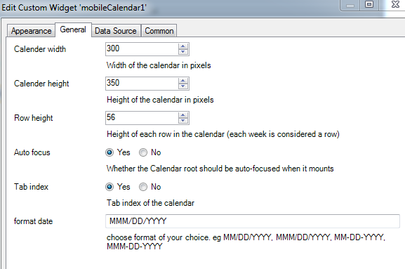

# Date Picker
A mobile friendly date picker  

## Features
---
 **Infinite scroll** – Just keep scrollin', just keep scrollin'
* **Customizeable** – Customize to the date format of your choice.
* **Year selection** – For rapidly jumping from year to year
* **Keyboard support** – ⬆️ ⬇️ ⬆️ ⬇️ ⬅️ ➡️ ⬅️ ➡️ ↩️
* **Mobile-friendly** – Silky smooth scrolling on mobile

## Dependencies
Mendix 7.11.0

## Demo project
---
https://date-picker.mxapps.io/

## Usage
Place the widget in a data view.

### Data source configuration
---

 - Model Configuration

 - On `Calendar entity` option of the `Data source` tab, browse and 
 select the "entity" you want.
 
 
 
 - On the ` Calendar attribute` option of the `Data source` tab, browse and 
 select the attribute on the tag entity selected above. 

## Issues, suggestions and feature requests
We are actively maintaining this widget, please report any issues or suggestion for improvement at https://github.com/Gfreedoms/DatePicker/issues

## Development and contribution
Please follow [development guide](/development.md). 
